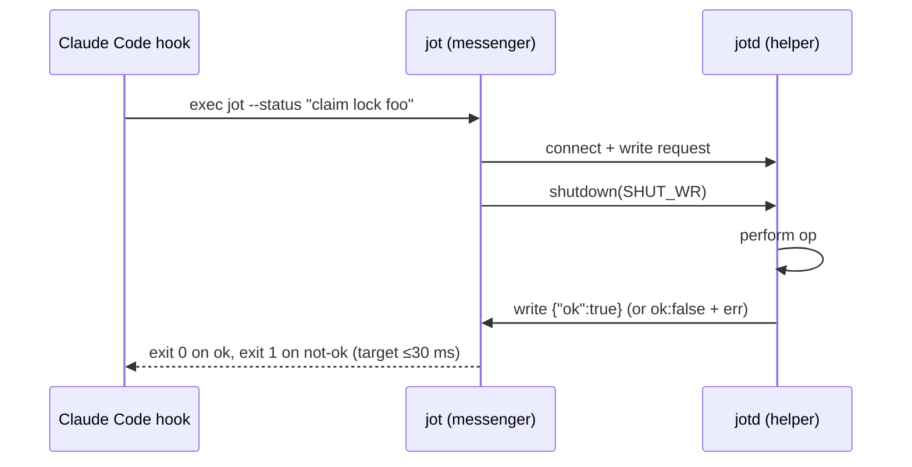
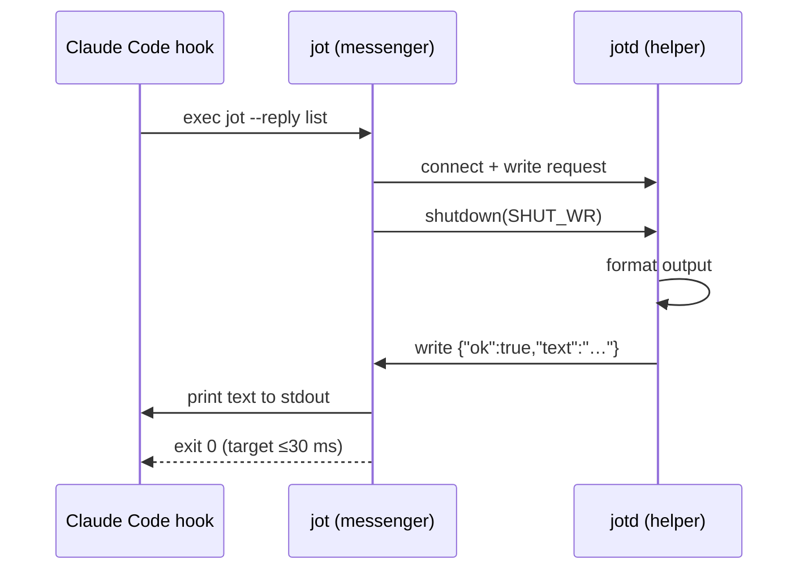

# Background Hook Architecture

## 1. Goals

1. Hook-to-exit latency low enough to feel continuous. Target: **under 10 ms for async, under 30 ms for modes that wait for a reply.**
2. Correctness under failure: if the helper is dead, slow, or crashes mid-message, the hook must still return quickly and the work must not be lost.
3. Run on macOS and Linux with no runtime dependencies.
4. Helper and messenger can be upgraded independently.

## 2. Decisions

| Concern              | Decision                                                                 |
| -------------------- | ------------------------------------------------------------------------ |
| Messenger language   | Go, shipped as `jot` binary                                              |
| Helper language      | Go, shipped as `jotd` binary (same module, two `main` packages)          |
| Transport            | Unix domain socket, `SOCK_STREAM`                                        |
| Framing              | Newline-delimited JSON, one request line + zero-or-one response line     |
| Wire protocol version| Integer `v` field on every message; v1 to start                          |
| Fallback on failure  | Append request to spool file; helper drains spool on startup             |
| Helper supervision   | Self-launch by messenger on first connect failure; `launchd`/`systemd` is optional polish, not required for v1 |

## 3. Components

Two binaries, one Go module:

```
jot/
├── cmd/
│   ├── jot/     → messenger binary (runs per hook invocation)
│   └── jotd/    → helper daemon (long-lived)
├── internal/
│   ├── proto/   → shared Request/Response types, JSON schema, version const
│   ├── paths/   → socket path, spool path, pid file path resolution
│   └── store/   → TODO persistence (append-only, fsync policy)
└── docs/design/
```

Both binaries import `internal/proto` so the schema is defined in one place.

## 4. Socket path resolution

Unix socket paths have a hard OS limit (≈104 bytes on macOS, ≈108 on Linux). To stay well under it and be per-user:

```
Linux:  ${XDG_RUNTIME_DIR}/jot.sock     if XDG_RUNTIME_DIR is set and writable
        /tmp/jot-${UID}.sock            otherwise
macOS:  /tmp/jot-${UID}.sock
```

Same rule for the PID file (`.pid` suffix) and log (`.log` suffix) sitting next to the socket.

## 5. Wire protocol

### Request (messenger → helper), one line

```json
{"v":1,"mode":"async","op":"jot","payload":{"text":"remember to check auth spec","tags":["todo"]}}
```

| Field     | Type       | Notes                                             |
| --------- | ---------- | ------------------------------------------------- |
| `v`       | int        | Protocol version. Helper rejects unknown.         |
| `mode`    | string     | `"async"` \| `"status"` \| `"reply"`              |
| `op`      | string     | Which operation. `"jot"`, `"list"`, etc.          |
| `payload` | object     | Op-specific. Opaque to transport layer.           |

### Response (helper → messenger), one line, omitted for `async`

```json
{"ok":true,"text":"Saved as todo #4172"}
```

| Field  | Type    | Notes                                                       |
| ------ | ------- | ----------------------------------------------------------- |
| `ok`   | bool    | Operation success.                                          |
| `err`  | string  | Present only on failure. Short human-readable message.      |
| `text` | string  | Present only for `reply` mode. Printed to messenger stdout. |

### Framing rules

- Exactly one request line, terminated by `\n`, max 64 KiB.
- Messenger calls `shutdown(SHUT_WR)` after writing the request to signal EOF to the helper.
- For `status`/`reply`, helper writes one response line and closes.
- For `async`, helper may still write a line; the messenger has already closed and exited, so the write hits `EPIPE`, which the helper logs at debug and ignores.

## 6. The three modes

### 6.1 Async (fire-and-forget)

```mermaid
sequenceDiagram
    participant Hook as Claude Code hook
    participant M as jot (messenger)
    participant H as jotd (helper)
    participant S as TODO store

    Hook->>M: exec jot --async "note text"
    M->>H: connect
    M->>H: write request line
    M->>H: shutdown(SHUT_WR)
    M-->>Hook: exit 0 (target ≤10 ms)
    H->>S: append + fsync
    Note over H: response write to closed conn fails; ignored
```

Messenger never reads. Helper does the work after the hook has already returned.

### 6.2 Status (pass/fail)



Messenger blocks up to the 200 ms deadline for the response line, then maps `ok` to exit code.

### 6.3 Reply (user-visible text)



Whatever the messenger prints to stdout is what Claude Code surfaces to the user.

## 7. Startup and lazy launch

Messenger startup sequence:

1. Compute socket path.
2. `net.DialTimeout("unix", path, 50ms)`. On success, proceed to write.
3. On failure (`ENOENT` or `ECONNREFUSED`), `fork`+`exec jotd` with `Setsid: true`, stdio redirected to `/dev/null` and the log file.
4. Retry dial with 10 ms backoff for up to 150 ms.
5. Still failing? Fall through to the spool path (§8.2). Exit 0 regardless; never block the hook.

Helper startup sequence:

1. Acquire exclusive `flock` on the PID file. If already held, another instance is running; exit 0.
2. If the socket file exists, `unlink` it (stale from previous crash).
3. `net.Listen("unix", path)`, `chmod 0600`.
4. Drain the spool file (§8.2) before accepting connections.
5. Register `SIGTERM`/`SIGINT` handler that closes the listener and removes the socket.
6. Accept loop, one goroutine per connection.

## 8. Failure handling

### 8.1 Timeouts

The messenger sets a single `SetDeadline` on the connection for the entire request. Default 200 ms. If any of connect/write/read exceeds it, the messenger aborts and falls through to the spool path.

### 8.2 Spool fallback

When the messenger cannot reach a healthy helper:

1. Append the marshaled request line (same JSON as the wire format) to `${state_dir}/spool.jsonl` using `O_APPEND|O_CREAT`. Atomic for writes under `PIPE_BUF` (4096 bytes); larger writes use an `flock` on the file.
2. Exit 0. The hook never sees the failure.

On next startup, before `Accept()`, the helper:

1. Reads `spool.jsonl` line by line.
2. Dispatches each as if it had arrived on the wire (only `async` mode makes sense here — `status` and `reply` requests whose messengers already exited have nowhere to return).
3. `rename` to `spool.jsonl.draining`, process, delete on success.

State dir:

```
Linux:  ${XDG_STATE_HOME:-$HOME/.local/state}/jot/
macOS:  $HOME/Library/Application Support/jot/
```

### 8.3 Stale socket

If a previous `jotd` crashed without cleanup, the socket file exists but `connect()` returns `ECONNREFUSED`. The messenger's lazy-launch path will spawn a new `jotd`; the new `jotd` unlinks the stale socket in step 2 of its startup.

### 8.4 Protocol version mismatch

Helper replies `{"ok":false,"err":"unsupported protocol version N"}` and closes. Messenger maps to exit 1. No spooling, because a version mismatch is a deployment bug, not a transient failure.

## 9. On-disk layout

```
/tmp/jot-${UID}.sock                               socket
/tmp/jot-${UID}.pid                                PID file with flock
/tmp/jot-${UID}.log                                helper log
${state_dir}/jot/spool.jsonl                       failure-mode spool
${state_dir}/jot/store.db                          TODO store (SQLite or append-only JSONL)
```

## 10. Code sketches

### 10.1 Shared types (`internal/proto/proto.go`)

```go
package proto

import "encoding/json"

const Version = 1

type Mode string

const (
    ModeAsync  Mode = "async"
    ModeStatus Mode = "status"
    ModeReply  Mode = "reply"
)

type Request struct {
    V       int             `json:"v"`
    Mode    Mode            `json:"mode"`
    Op      string          `json:"op"`
    Payload json.RawMessage `json:"payload,omitempty"`
}

type Response struct {
    OK   bool   `json:"ok"`
    Err  string `json:"err,omitempty"`
    Text string `json:"text,omitempty"`
}
```

### 10.2 Messenger (`cmd/jot/main.go`, abridged)

```go
func main() {
    req := parseArgs(os.Args) // builds proto.Request from CLI flags
    line, _ := json.Marshal(req)
    line = append(line, '\n')

    conn, err := dialWithLazyStart()
    if err != nil {
        spoolAppend(line)
        return // exit 0
    }
    defer conn.Close()
    conn.SetDeadline(time.Now().Add(200 * time.Millisecond))

    if _, err := conn.Write(line); err != nil {
        spoolAppend(line)
        return
    }
    conn.(*net.UnixConn).CloseWrite()

    if req.Mode == proto.ModeAsync {
        return // fire-and-forget, done
    }

    respLine, err := bufio.NewReader(conn).ReadBytes('\n')
    if err != nil && err != io.EOF {
        os.Exit(2)
    }
    var resp proto.Response
    if err := json.Unmarshal(respLine, &resp); err != nil {
        os.Exit(2)
    }
    if req.Mode == proto.ModeReply {
        io.WriteString(os.Stdout, resp.Text)
    }
    if !resp.OK {
        if resp.Err != "" {
            fmt.Fprintln(os.Stderr, resp.Err)
        }
        os.Exit(1)
    }
}

func dialWithLazyStart() (net.Conn, error) {
    path := paths.Socket()
    if c, err := net.DialTimeout("unix", path, 50*time.Millisecond); err == nil {
        return c, nil
    }
    if err := spawnHelper(); err != nil {
        return nil, err
    }
    deadline := time.Now().Add(150 * time.Millisecond)
    for time.Now().Before(deadline) {
        time.Sleep(10 * time.Millisecond)
        if c, err := net.DialTimeout("unix", path, 20*time.Millisecond); err == nil {
            return c, nil
        }
    }
    return nil, errors.New("helper unreachable")
}

func spawnHelper() error {
    cmd := exec.Command("jotd")
    cmd.SysProcAttr = &syscall.SysProcAttr{Setsid: true}
    cmd.Stdin, cmd.Stdout, cmd.Stderr = nil, nil, nil
    return cmd.Start()
}
```

### 10.3 Helper (`cmd/jotd/main.go`, abridged)

```go
func main() {
    if err := acquirePIDLock(paths.PIDFile()); err != nil {
        os.Exit(0) // another instance is running
    }
    _ = os.Remove(paths.Socket()) // clear stale
    ln, err := net.Listen("unix", paths.Socket())
    if err != nil { log.Fatal(err) }
    os.Chmod(paths.Socket(), 0600)

    sig := make(chan os.Signal, 1)
    signal.Notify(sig, syscall.SIGTERM, syscall.SIGINT)
    go func() {
        <-sig
        ln.Close()
        os.Remove(paths.Socket())
        os.Exit(0)
    }()

    drainSpool() // process pending async work before serving new requests

    for {
        conn, err := ln.Accept()
        if err != nil {
            if errors.Is(err, net.ErrClosed) { return }
            log.Print(err); continue
        }
        go handle(conn)
    }
}

func handle(conn net.Conn) {
    defer conn.Close()
    conn.SetDeadline(time.Now().Add(1 * time.Second))

    line, err := bufio.NewReader(conn).ReadBytes('\n')
    if err != nil && err != io.EOF { return }

    var req proto.Request
    if err := json.Unmarshal(line, &req); err != nil {
        writeResp(conn, proto.Response{OK: false, Err: "bad request"})
        return
    }
    if req.V != proto.Version {
        writeResp(conn, proto.Response{OK: false, Err: fmt.Sprintf("unsupported protocol version %d", req.V)})
        return
    }

    resp := dispatch(req) // op-specific logic
    if req.Mode != proto.ModeAsync {
        writeResp(conn, resp)
    }
}

func writeResp(conn net.Conn, r proto.Response) {
    line, _ := json.Marshal(r)
    _, _ = conn.Write(append(line, '\n')) // EPIPE ignored
}
```

## 11. Security

- Socket is created `0600` and lives under per-user `/tmp` or `$XDG_RUNTIME_DIR`. No other user can connect.
- No network exposure; Unix sockets are local-only.
- Payload size is capped at 64 KiB per request.
- The helper does not execute arbitrary shell from payload fields; ops are an enumerated list in `dispatch`.

## 12. Deliberately out of scope for v1

- Multi-user or multi-host operation.
- TLS / auth (not meaningful for local Unix sockets with filesystem permissions).
- Structured logging / metrics pipeline. A plain log file is enough.
- `launchd` plist and `systemd --user` unit. Lazy launch on first use is sufficient; OS-level supervision is a milestone 5+ concern.
- Hot reload of helper without dropping in-flight connections.

## 13. Open questions to resolve before coding

1. TODO store format: SQLite or append-only JSONL? JSONL is simpler and matches the spool; SQLite gives free `list`/`search`.
2. Does `op: "list"` return plain text or structured JSON the messenger formats? Plain text is simpler; structured lets the messenger do things like colorize.
3. Should `jot` and `jotd` live in the same module with two `main` packages, or one binary that dispatches on `argv[0]`? Two separate `cmd/` packages is cleaner.